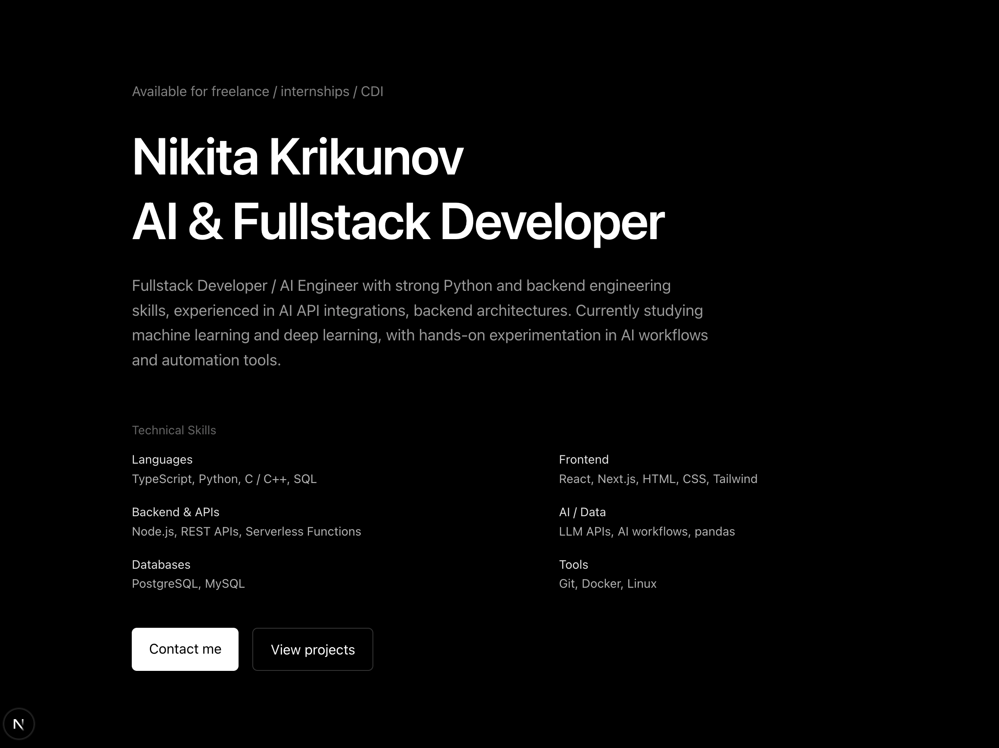
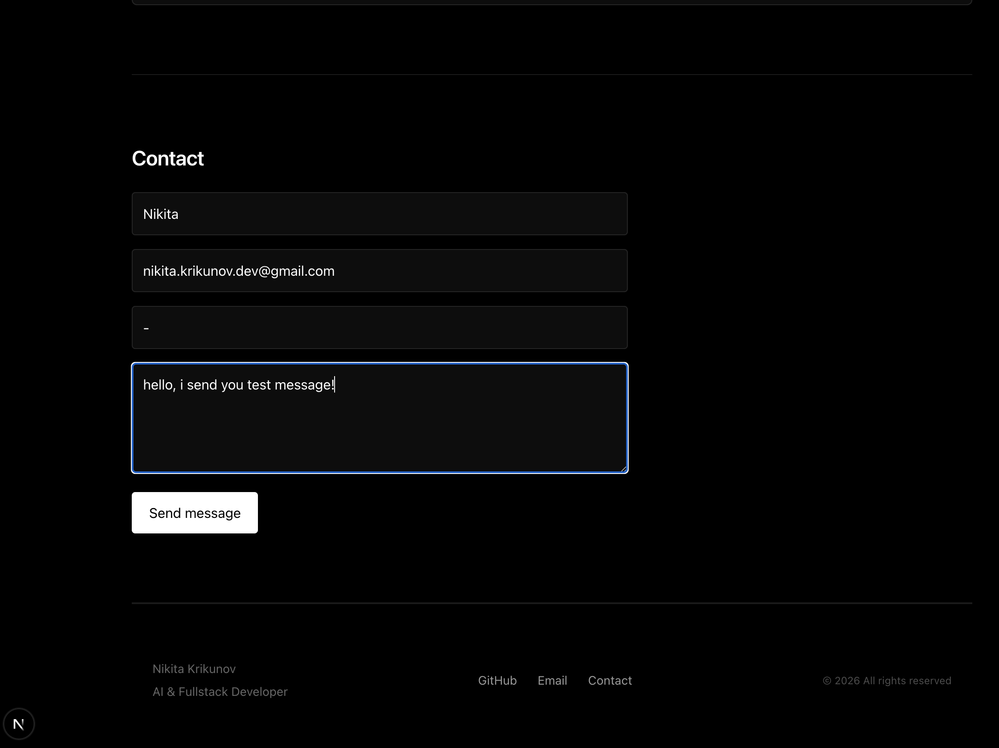
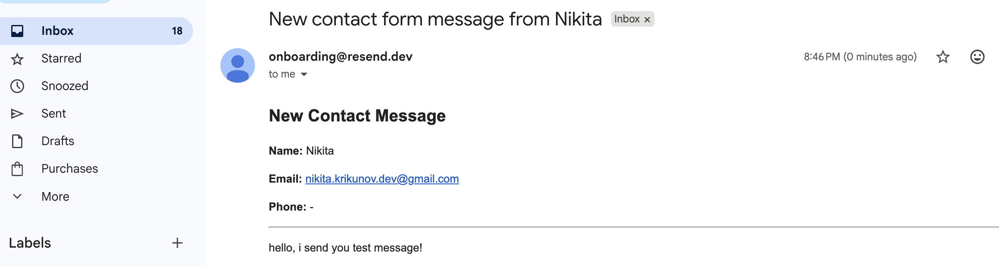
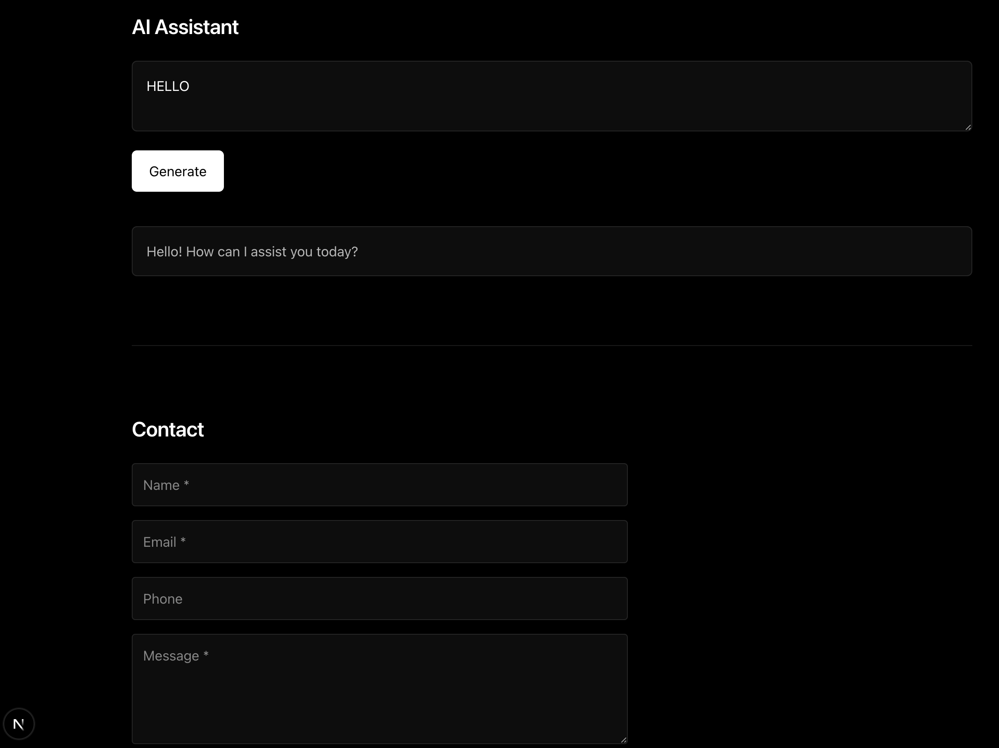

# AI Fullstack Developer - Portfolio Landing

Персональный portfolio-лендинг, разработанный с использованием Next.js и TypeScript.

## Preview



Чтобы запустить проект используйте:

npm run dev
# or
yarn dev
# or
pnpm dev
# or
bun dev

Создать файл .env.local и добавить свои ключи API:
OPENAI_API_KEY=your_openai_key
RESEND_API_KEY=your_resend_key

Откройте [http://localhost:3000](http://localhost:3000) в браузере, чтобы просмотреть лендинг.

---

# Используемый стек

Frontend:
- Next.js 16
- React
- TypeScript
- TailwindCSS

Backend / API:
- Next.js Route Handlers
- REST API
- Zod validation
- Resend email API

AI:
- OpenAI API (gpt-4.o-mini)
- AI-generated text helper

Инструменты:
- Git
- npm
- Vercel

---

# Реализация контактной формы

Форма включает:

- управление состоянием формы на frontend
- backend-валидацию через Zod
- обработку запросов через API route
- loading и error состояния
- отправку email через Resend API

После успешной отправки:
- сообщение отправляется владельцу сайта
- пользователю отправляется confirmation email

Валидация реализована на backend через Zod-схемы.

## Форма



## Сообщение и доставка




---

# AI-интеграция

Проект включает простую AI-интеграцию через OpenAI API.

AI-блок демонстрирует:
- работу с внешним API
- обработку асинхронных запросов
- взаимодействие frontend ↔ backend
- генерацию AI-ответов

## AI-демо



---

# Какие AI-инструменты использовались

AI-инструменты использовались для:
- проектирования архитектуры проекта
- идей по UI-структуре
- организации компонентов
- проектирования validation flow
- отладки и поиска ошибок

---

# Что дорабатывалось вручную

Во время разработки вручную были доработаны и исправлены:

- адаптивный layout
- консистентность spacing и typography
- UX контактной формы
- отображение validation ошибок
- визуальная иерархия секций
- структура контента
- обработка API ошибок

---

# Структура проекта

```bash
src/
 ├── app/
 │    ├── api/
 │    ├── page.tsx
 │    └── layout.tsx
 │
 ├── components/
 │    ├── sections/
 │    ├── layout/
 │    └── ui/
 │
 └── lib/
      └── validators.ts
